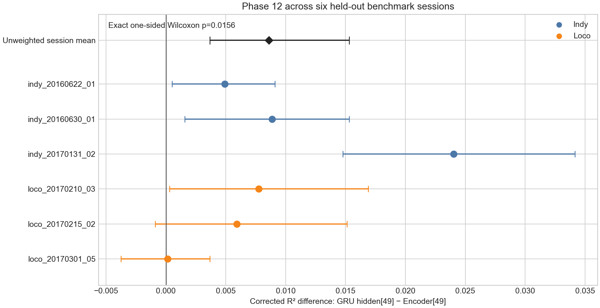

# Phase 12 跨 session 技术报告：GRU hidden[49] vs Encoder[49]

## 技术结论

**整体上，GRU hidden[49] 显著优于 Encoder[49]，但优势不是在每个 session 内都单独显著。** 六个 benchmark sessions 的 held-out corrected R² 差值全部为正。以 session 为独立分析单位，平均提升为 **+0.00861 R²**，100,000 次 session bootstrap 的 95% CI 为 **[+0.00366, +0.01530]**。Exact one-sided Wilcoxon signed-rank test 为 **p=0.015625**；不依赖差值大小、只检查方向的 exact sign test 同样为 **p=0.015625**。Two-sided Wilcoxon sensitivity test 为 **p=0.03125**。

这支持把 GRU hidden[49] 作为下一版 MCU external-memory query 的默认候选，但还不支持声称它在任何 session 都必然胜出：六场中有四场的单 session reach-bootstrap 95% CI 完全高于 0，另外两场虽为正，但区间跨过 0。

下图的每个圆点是一场 session 的 `GRU corrected R² − Encoder corrected R²`，误差线是以 reach 为单位的 95% bootstrap CI。黑色菱形是六场不加权平均及以 session 为单位的 bootstrap CI。所有点都在零线右侧，但两个 Loco session 的区间跨零，说明跨 session 方向一致、单 session 效应强度不一致。

## 六场 held-out 对比

| Session | Base R² | Encoder corrected R² | GRU corrected R² | GRU − Encoder | Reach-bootstrap 95% CI | 单场显著 |
|---|---:|---:|---:|---:|---:|:---:|
| indy_20160622_01 | 0.7820 | 0.8103 | 0.8153 | +0.00492 | [+0.00053, +0.00910] | 是 |
| indy_20160630_01 | 0.6341 | 0.6696 | 0.6784 | +0.00886 | [+0.00159, +0.01531] | 是 |
| indy_20170131_02 | 0.6236 | 0.6909 | 0.7149 | +0.02403 | [+0.01477, +0.03415] | 是 |
| loco_20170210_03 | 0.6393 | 0.6463 | 0.6540 | +0.00776 | [+0.00030, +0.01691] | 是 |
| loco_20170215_02 | 0.5609 | 0.5613 | 0.5672 | +0.00593 | [−0.00089, +0.01512] | 否 |
| loco_20170301_05 | 0.7247 | 0.7374 | 0.7376 | +0.00015 | [−0.00375, +0.00366] | 否 |

Indy 三场的平均 `GRU − Encoder` 为 **+0.01260 R²**，Loco 三场为 **+0.00461 R²**。这个 subject 差异目前只能作为描述性信号：每组只有三个 sessions，不足以可靠断言 GRU 在 Indy 上的收益一定大于 Loco。

## 为什么主结论使用 session-level test

每场内相邻 40 ms bins 高度自相关，直接把所有 test bins 合并会制造远大于真实值的有效样本量。因此本报告使用两层不确定性分析：

- 单场 CI：以 reach 为单位 bootstrap 1,000 次。
- 跨场 CI：先得到每场一个 GRU−Encoder effect，再以 session 为单位 bootstrap 100,000 次。
- 主假设检验：六个配对 session effect 的 exact one-sided Wilcoxon test。
- 敏感性检验：只看六场效应方向的 exact sign test，以及 two-sided Wilcoxon test。

这是用户在查看第一场结果之后提出的后续假设，因此 one-sided test 与明确的 `GRU > Encoder` 问题一致；同时提供 two-sided p-value，避免结论只依赖单侧选择。

## 协议一致性与限制

六场都使用各自保存的 fold-1 Midsize checkpoint。Bank、residual 和两套 PCA 仅来自该场 train reaches；每种 representation 的 K、temperature 和 blend 仅在 validation reaches 上选择；test reaches 不参与 bank、PCA、调参或 query winner selection。最终比较使用完全相同的 50-step rolling policy、32D representation PCA、32D long-context PCA 和 train-bank entries。

仍需保留三个限制：

- 只有六个 sessions，跨 session p-value 的分辨率有限；exact one-sided test 的最小非零 p-value就是 1/64。
- 每种 representation 独立在 validation 上选择检索参数，结论反映的是“各自经过相同预算调优后的最佳系统”，不是固定同一 K/temperature/blend 的纯 representation effect。
- 当前 memory archives 是 PC 实验格式；GRU query 仍需 MCU graph 暴露 hidden state，之后才能进行 BCIMEM export 和 STM32 latency/recall 实测。

## 建议

下一版 large-model firmware prototype 可以默认采用 `GRU hidden[49] + long context`，同时保留 Encoder query 的编译期开关。进入正式选择前，应在真正的 int8 PCA、IVF、FP16 residual 路径上完成六场 firmware-style replay，并按 session 再做一次配对分析；如果 GRU 的跨场 CI 仍高于 0，再将其固定为 production representation。
