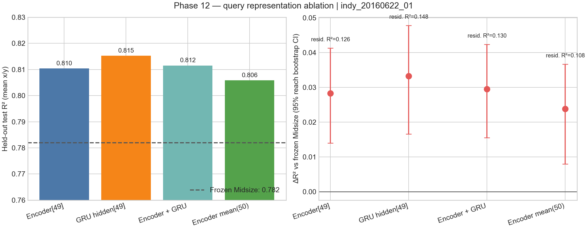
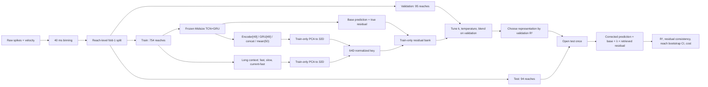

# Phase 12 技术报告：External-memory query representation ablation

## 结论

在第一个 Indy benchmark session `indy_20160622_01` 上，**GRU hidden[49] 是本轮 validation-selected winner**。同一套 50-step rolling Midsize baseline 的 held-out test R² 为 **0.7820**；加入 GRU-query external-memory residual correction 后为 **0.8153**，提升 **+0.0333 R²**。以 reach 为单位的 1,000 次 bootstrap 95% CI 为 **[+0.0166, +0.0478]**，在这个 session 内提升明确为正。

GRU hidden[49] 相对 Encoder[49] 的 test R² 额外提升为 **+0.0049**，reach-bootstrap 95% CI 为 **[+0.0005, +0.0091]**。因此它在这一 session 上不仅胜过冻结的 Midsize baseline，也以较小但可检测的幅度胜过 Encoder[49]。这仍是单 session 结果，不能直接外推到其他日期或跨 session 部署。

这里的 baseline 特指**同一个 fold-1 checkpoint、同一批 test reach、同一 50-step rolling inference policy** 下不使用 memory 的预测。Phase 7 的 chunked inference 分数和按 test R² 选出的 best-fold 分数使用了不同推理或选择协议，不能拿来与本表的 0.8153 做直接显著性比较。

## Held-out 结果

| Query representation | Corrected test R² | ΔR² vs Midsize | 95% CI | Residual consistency R² | Projected MCU bank |
|---|---:|---:|---:|---:|---:|
| Encoder[49] | 0.8103 | +0.0283 | [+0.0140, +0.0413] | 0.1256 | 3.128 MiB |
| **GRU hidden[49]** | **0.8153** | **+0.0333** | **[+0.0166, +0.0478]** | **0.1483** | **3.128 MiB** |
| Encoder[49] + GRU[49] | 0.8115 | +0.0295 | [+0.0156, +0.0423] | 0.1304 | 3.136 MiB |
| Encoder 50-step masked mean | 0.8058 | +0.0238 | [+0.0080, +0.0366] | 0.1078 | 3.128 MiB |

这里的 residual consistency R² 定义为：用最近邻加权 residual 预测 held-out true residual，相比恒为零的 residual predictor 可解释的 residual variance。GRU 的 0.1483 最高，同时其邻居 residual dispersion 最低（0.00898），两项证据方向一致。

## 完整 workflow

训练侧和运行侧采用同一语义：每个 query 都来自严格因果的 50-bin rolling window；不足 50 个 bin 的 reach 开头在左侧补零，mean-pooling 会 mask 掉这些 padding。Long context 对归一化后的 192D feature 分别做 α=0.02 和 α=0.005 的因果 EWMA，并拼接 `[fast, slow, current-fast]` 成 576D，再用 train-only PCA 压到 32D。四种 representation 均压到 32D，因此最终 key 都是 64D。

## 数据隔离和选择规则

- Bank、true residual、representation PCA、context PCA 全部只使用 754 个 train reach（33,100 entries）。
- 每种 representation 的 `k ∈ {8,16,32,64,128}`、temperature 和 blend 只在 95 个 validation reach 上选择。
- Winner 由 validation corrected R² 决定；94 个 test reach 不参与 PCA、bank、调参或 winner selection。
- 最终不确定性按 reach 重采样，而不是按高度自相关的 bin 重采样。
- 使用 `checkpoint.pt` fold-1；没有使用按 test R² 选择的 `best_fold_checkpoint.pt`。

## Bank footprint 与检索成本

四个 PC 实验 bank 都已生成；压缩 archive 实际约 1.70–1.72 MiB。按当前 MCU entry stride 96 bytes、256 clusters、16 probes 和 int8 64D key 估算，GRU bank 的部署 footprint 为 **3.128 MiB**，均匀 cluster 假设下每次 query 约访问 2,069 个候选，约 **148,800 次 int8 MAC / 148,800 key bytes read**。

PC 上的 exact `cKDTree` test 检索约为 **512 μs/query**（GRU variant）。这不是 STM32 实测 latency；MCU latency 必须在固件侧构建相同 query 并在目标板 cycle counter 下测量。当前 `.memlib` 是自描述的 `phase12_pc_memlib_v1` NumPy archive，不是可直接烧录的 `BCIMEM` firmware-v1 binary。

## 下一步判断

本轮第一性原理标准给出了肯定信号：GRU representation 中相近的 key 确实对应更一致的 residual。但进入固件前还需要两步：

1. 在其余 Indy/Loco sessions 重复 Phase 12，按 session 汇总 ΔR²，确认不是单 session 偶然收益。
2. 为 MCU graph 暴露 GRU hidden[49]，生成真正的 BCIMEM bank，并实测 IVF recall、cycle latency、SRAM/flash traffic；在固件数值路径上重放 golden vectors。

## 可复现文件

- `run.py`：完整实验、调参与 artifact export。
- `plot_results.py`：从 CSV 生成比较图。
- `validate_artifacts.py`：检查 split policy、winner selection 与四个 memlib 的 shape/dtype/schema。
- `metrics.json`：完整机器可读结果与 caveats。
- `representation_comparison.csv`：核心结果表。
